# Sitrep Architecture

A detailed technical document describing the architecture, data flow, and component responsibilities of the sitrep TUI diagnostic tool.

---

## Table of Contents

1. [High-Level Architecture](#1-high-level-architecture)
2. [Component Hierarchy](#2-component-hierarchy)
3. [Main Event Loop](#3-main-event-loop)
4. [Data Flow by Scenario](#4-data-flow-by-scenario)
5. [Sequence Diagrams](#5-sequence-diagrams)
6. [Refresh & Polling Strategy](#6-refresh--polling-strategy)
7. [Component Responsibility Matrix](#7-component-responsibility-matrix)

---

## 1. High-Level Architecture

```
┌─────────────────────────────────────────────────────────────────────────────────┐
│                              main.rs (Entry Point)                              │
│  • Panic hook (restore terminal)                                                │
│  • SIGTERM/SIGINT handlers → should_quit                                        │
│  • app::run(should_quit)                                                        │
└─────────────────────────────────────────────────────────────────────────────────┘
                                        │
                                        ▼
┌─────────────────────────────────────────────────────────────────────────────────┐
│                              app (Application Layer)                            │
│  ┌─────────────┐  ┌─────────────┐  ┌─────────────┐  ┌─────────────┐             │
│  │  event_loop │  │   input     │  │   render    │  │   state     │             │
│  │  • tick     │  │  • keys     │  │  • dispatch │  │  • pending  │             │
│  │  • poll     │  │  • tabs     │  │  • views    │  │  • resolve  │             │
│  └─────────────┘  └─────────────┘  └─────────────┘  └─────────────┘             │
└─────────────────────────────────────────────────────────────────────────────────┘
                                        │
                    ┌───────────────────┼───────────────────┐
                    ▼                   ▼                   ▼
┌───────────────────────┐ ┌───────────────────────┐ ┌───────────────────────┐
│   controller/         │ │  docker_controller    │ │  swarm_controller     │
│   (System Monitor)    │ │  (Docker Monitor)     │ │  (Swarm Monitor)      │
│   • sysinfo           │ │  • bollard API        │ │  • docker CLI         │
│   • collectors        │ │  • containers         │ │  • nodes/services     │
└───────────────────────┘ └───────────────────────┘ └───────────────────────┘
                    │                   │                   │
                    ▼                   ▼                   ▼
┌───────────────────────┐ ┌───────────────────────┐ ┌───────────────────────┐
│   collectors/         │ │  docker (bollard)     │ │  swarm (CLI)          │
│   • mac / linux       │ │  • list_containers    │ │  • list_nodes         │
│   • OS-specific I/O   │ │  • tail_logs          │ │  • list_services      │
└───────────────────────┘ └───────────────────────┘ └───────────────────────┘
                                        │
                                        ▼
┌─────────────────────────────────────────────────────────────────────────────────┐
│                              view (Presentation Layer)                          │
│  • Presenter (tab_bar, system, containers, swarm, logs, confirmation)           │
│  • Reads from monitors' data + UI state                                         │
└─────────────────────────────────────────────────────────────────────────────────┘
```

---

## 2. Component Hierarchy

```
src/
├── main.rs                    # Thin entry point
├── lib.rs                     # Library root, re-exports
│
├── app/                       # Application orchestration
│   ├── mod.rs                 # App struct, run(), restore_terminal()
│   ├── event_loop.rs          # Tick, poll_logs, poll_actions, refresh_on_tab_switch
│   ├── input.rs               # Key handling, view-specific handlers
│   ├── render.rs              # Render dispatch by AppView
│   └── state.rs               # PendingAction, SwarmOverviewItem, resolve_swarm_overview_item
│
├── model/                     # Data structures (no logic)
│   ├── app.rs                 # AppView enum
│   ├── system.rs              # MonitorData, UIState, ProcessGroup, etc.
│   ├── docker.rs              # DockerContainerInfo, LogViewState, ContainerUIState
│   └── swarm.rs               # SwarmNodeInfo, SwarmServiceInfo, SwarmUIState, etc.
│
├── view/                      # Terminal rendering
│   ├── mod.rs                 # Presenter, RowKind
│   ├── tab_bar.rs             # Tab bar rendering
│   ├── system.rs              # System report (sections, processes)
│   ├── containers.rs          # Container list
│   ├── swarm.rs               # Swarm overview, tasks
│   ├── logs.rs                # Container + service logs
│   ├── confirmation.rs        # Pending action prompt
│   └── shared.rs              # truncate_str, safe_truncate, progress_bar
│
├── controller/                # System data collection
│   ├── mod.rs                 # Monitor, update()
│   └── process.rs             # build_live_groups, compute_top_processes
│
├── docker_controller.rs        # Docker container + log management
├── swarm_controller.rs         # Swarm cluster + service management
│
├── docker.rs                   # Bollard API wrapper (async)
├── swarm.rs                    # Docker CLI wrapper (sync subprocess)
│
├── layout.rs                   # Section layout (collapsible)
│
└── collectors/                 # OS-specific system metrics
    ├── mod.rs                 # SystemCollector trait
    ├── mac.rs                 # macOS: iostat, nettop, lsof, sysctl
    └── linux.rs               # Linux: /proc, ss
```

---

## 3. Main Event Loop

The main loop in `app::run()` follows this flow every iteration:

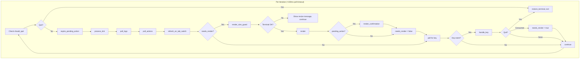

### Loop Timing

| Phase | Trigger | Interval |
|-------|---------|----------|
| **Tick** | `process_tick()` | Every 3 seconds (only active view's monitor) |
| **Log poll** | `poll_logs()` | Every loop (~100ms) when in log view |
| **Action poll** | `poll_actions()` | Every loop when action in progress |
| **Tab switch** | `refresh_on_tab_switch()` | On view change, min 500ms between refreshes |
| **Key poll** | `crossterm::event::poll` | Up to 100ms or remaining tick time |

---

## 4. Data Flow by Scenario

### 4.1 System View

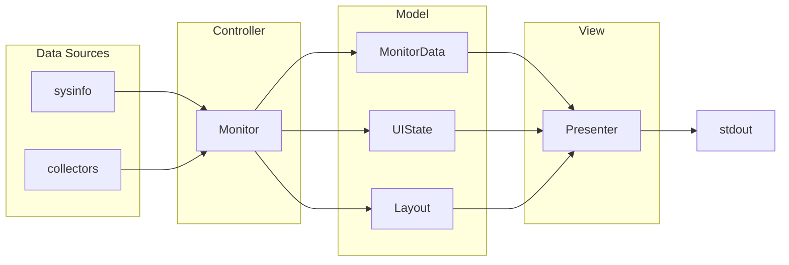

**Data ownership:**
- `Monitor` owns: `last_data` (MonitorData), `ui_state`, `layout`
- `Monitor::update()`: sysinfo refresh → collectors → process grouping → `last_data`
- `Presenter::render()`: reads `last_data`, mutates `ui_state` (expansion), returns `row_mapping`

---

### 4.2 Containers View

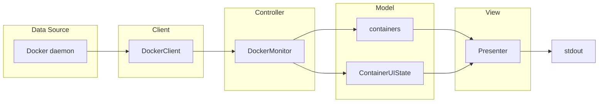

**Data flow:**
- `DockerMonitor::update()`: `DockerClient::list_containers()` + `get_all_cpu_percents()` → `containers`
- `Presenter::render_containers()`: reads `containers`, `ui_state`, `status_message`

---

### 4.3 Container Logs View

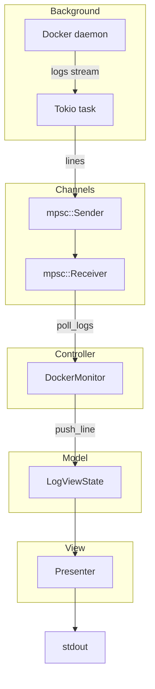

**Data flow:**
- `DockerMonitor::start_log_stream()`: spawns tokio task, returns `mpsc::Receiver`
- `poll_logs()`: drains receiver (up to 100 lines) into `LogViewState.lines`
- `Presenter::render_logs()`: reads `log_state` (lines, scroll_offset, etc.)

---

### 4.4 Swarm Overview

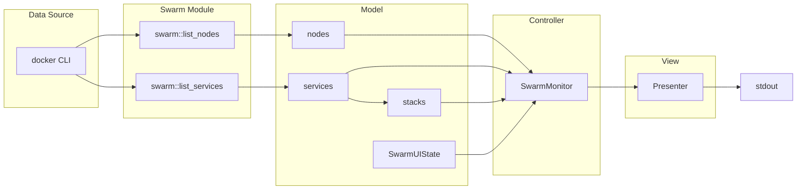

**Data flow:**
- `SwarmMonitor::update()`: `list_nodes()`, `list_services()` → `build_stacks()` → `generate_warnings()`
- `Presenter::render_swarm_overview()`: reads cluster_info, nodes, stacks, services, ui_state, warnings

---

### 4.5 Swarm Service Tasks

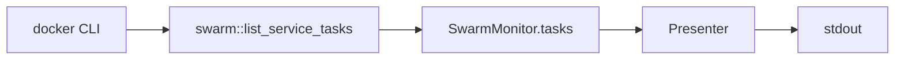

**Data flow:**
- `enter_task_view(service_id, service_name)`: `list_service_tasks()` → `tasks`, `view_level = ServiceTasks`
- `update()` when in ServiceTasks: refreshes `tasks` on each tick

---

### 4.6 Swarm Service Logs

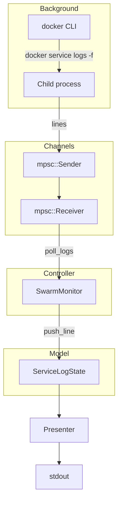

**Data flow:**
- `start_service_log_stream()`: spawns `docker service logs -f` child, `LogStreamHandle` with receiver
- `poll_logs()`: drains receiver (up to 200 lines) into `ServiceLogState.lines`

---

### 4.7 Destructive Actions (Pending Confirmation)

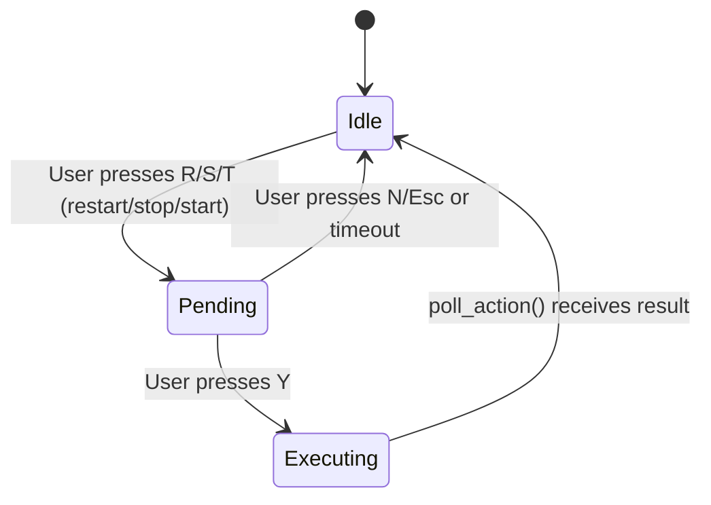

**Data flow:**
- User triggers action → `app.pending_action = Some(PendingAction { kind, expires })`
- Render shows confirmation overlay
- User presses Y → execute action (background thread) → `action_receiver`
- `poll_actions()` drains result → `status_message`, `action_in_progress = false`

---

## 5. Sequence Diagrams

### 5.1 Startup & First Render

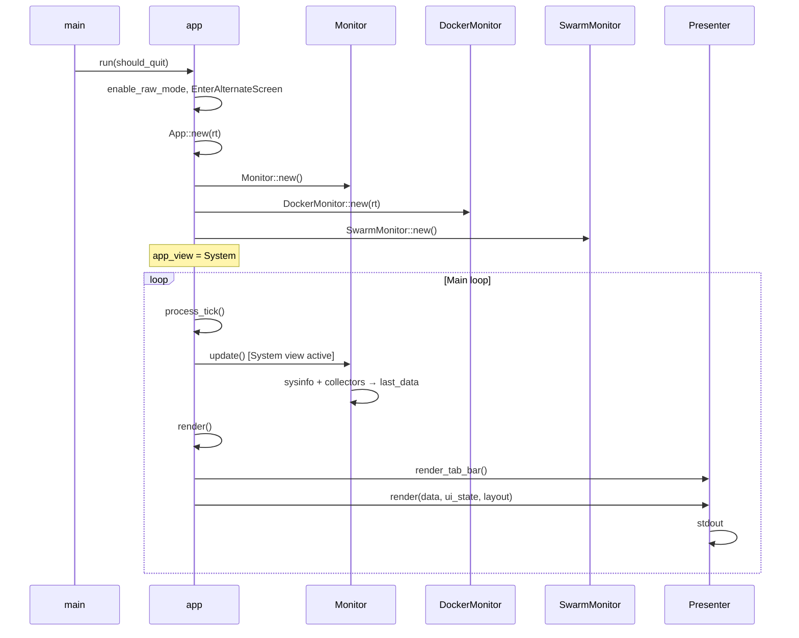

---

### 5.2 Tab Switch (System → Containers)

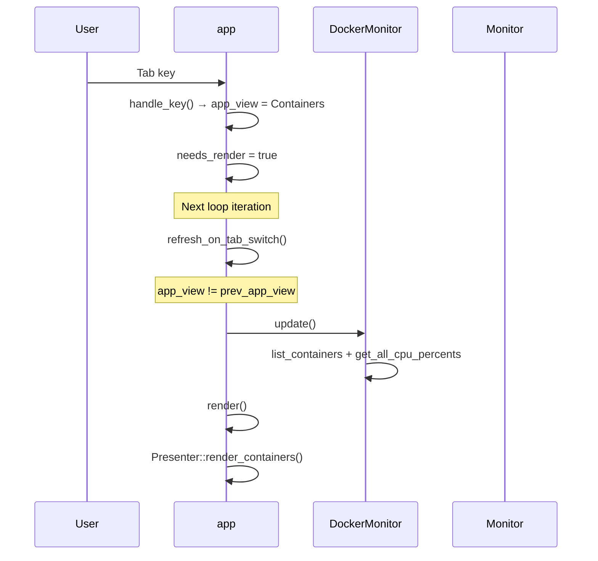

---

### 5.3 Enter Container Logs

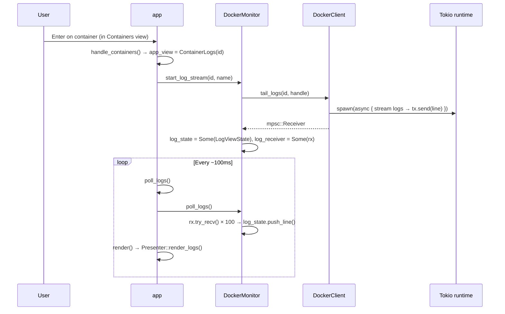

---

### 5.4 Swarm: Drill into Service Tasks

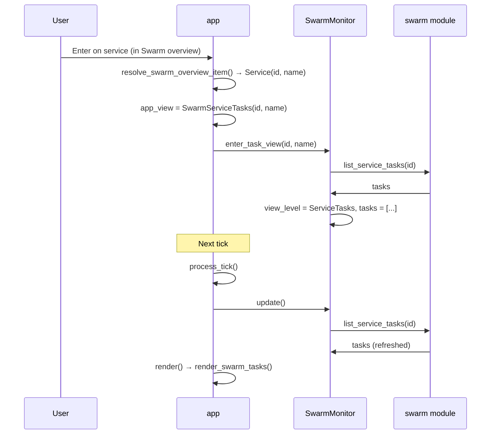

---

### 5.5 Rolling Restart (with Confirmation)

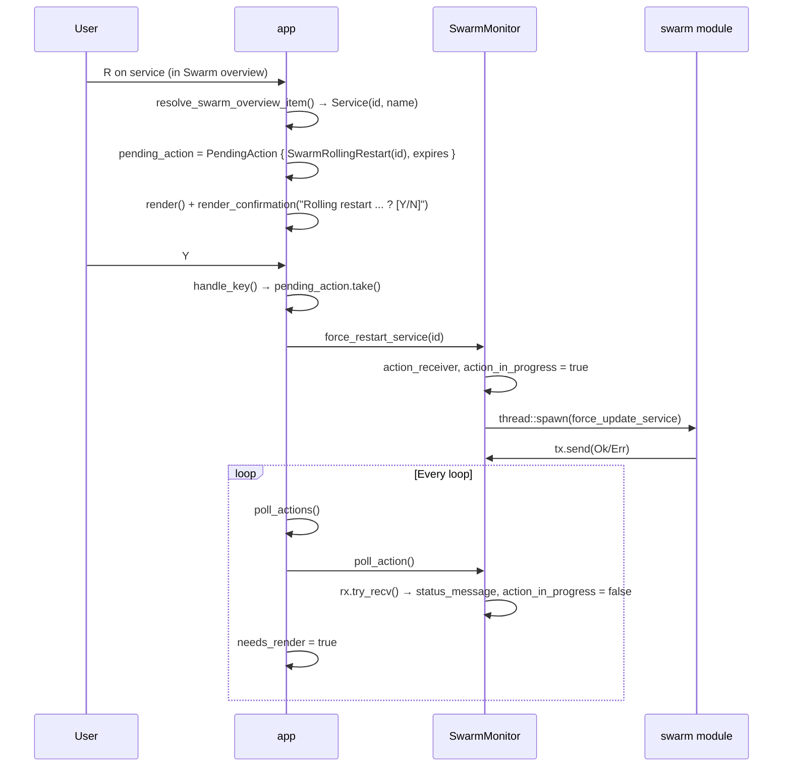

---

## 6. Refresh & Polling Strategy

### Selective Refresh (Tab-Based)

Only the **active view's** monitor is refreshed on each tick. This reduces I/O when the user is on a single tab.

| AppView | Monitor Updated on Tick |
|---------|-------------------------|
| System | Monitor (controller) |
| Containers, ContainerLogs | DockerMonitor |
| Swarm, SwarmServiceTasks, SwarmServiceLogs | SwarmMonitor |

### Tab Switch Refresh

When the user switches tabs, `refresh_on_tab_switch()` triggers an **immediate** update of the new view's monitor. A minimum 500ms throttle prevents rapid tab switching from hammering I/O.

### Swarm Recheck (Standalone Mode)

When Docker is in standalone mode (not Swarm), `SwarmMonitor::recheck_swarm()` runs every **10th tick** (~30 seconds) to detect if the user has initialized a Swarm.

### Log Polling

- **Container logs**: `poll_logs()` drains up to 100 lines per call when `AppView::ContainerLogs`
- **Service logs**: `poll_logs()` drains up to 200 lines per call when `AppView::SwarmServiceLogs`

### Action Polling

Background actions (start/stop/restart container, rolling restart, scale) use `try_recv()` so the main loop stays responsive. When a result arrives, `needs_render = true` triggers a redraw.

---

## 7. Component Responsibility Matrix

| Component | Owns | Updates | Reads From |
|-----------|------|---------|------------|
| **Monitor** | last_data, ui_state, layout, history | sysinfo, collectors, process grouping | — |
| **DockerMonitor** | containers, ui_state, log_state, status_message | DockerClient (list, stats, logs) | — |
| **SwarmMonitor** | nodes, services, stacks, tasks, ui_state, log_state, warnings | swarm module (CLI) | — |
| **App** | app_view, row_mapping, pending_action, tick state | event_loop, input | all monitors |
| **Presenter** | — | ui_state (expansion), row_mapping (returned) | monitors' data |
| **input** | — | app_view, monitors' ui_state, pending_action | App |

### Data Ownership Summary

```
App
├── monitor: Monitor          → last_data, ui_state, layout
├── docker_monitor: DockerMonitor  → containers, ui_state, log_state
├── swarm_monitor: SwarmMonitor    → nodes, services, stacks, tasks, ui_state, log_state
├── app_view: AppView
├── row_mapping: Vec<(Pid, RowKind)>   ← from Presenter::render (System view)
└── pending_action: Option<PendingAction>
```

### No Shared Mutable State

Each monitor owns its data. The app holds references to monitors and passes them to render/input. There is no global mutable state beyond the `App` struct itself.

---

## 8. View Navigation (AppView State Machine)

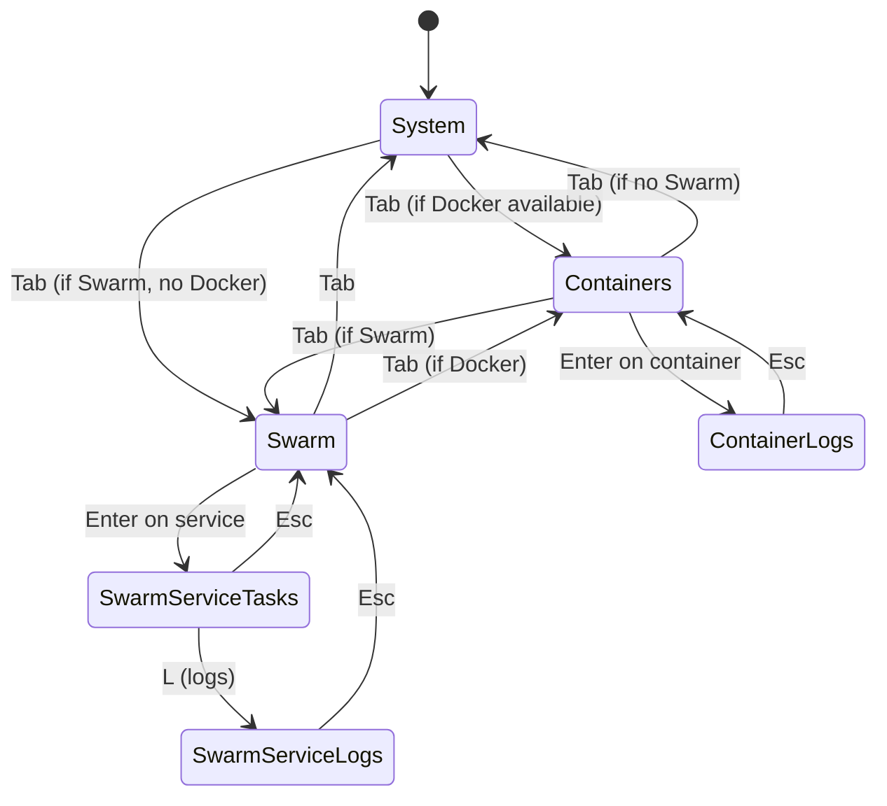

### Tab Visibility

| Tab | Shown When |
|-----|------------|
| System | Always |
| Containers | `docker_monitor.is_available()` |
| Swarm | `swarm_monitor.is_swarm()` |

Tab order: **System → Containers → Swarm → System** (wraps). Tabs are hidden when their backend is unavailable.

---

## 9. Model Type Relationships

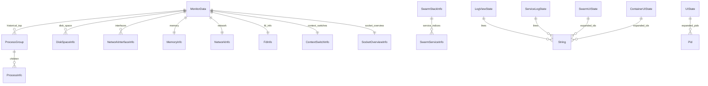

---

## 10. I/O and Concurrency Summary

| Operation | Blocking? | Concurrency |
|-----------|-----------|-------------|
| System monitor update | Yes (sysinfo, collectors) | Main thread |
| Docker list_containers | Yes (block_on) | Main thread |
| Docker get_all_cpu_percents | Yes (block_on, but concurrent inside) | join_all futures |
| Docker tail_logs | No (async task) | Tokio spawn, mpsc channel |
| Swarm list_nodes/services | Yes (Command::output) | Main thread |
| Swarm tail_service_logs | No (child process) | std::thread, mpsc channel |
| Container start/stop/restart | No (background thread) | std::thread, mpsc channel |
| Swarm force_restart/scale | No (background thread) | std::thread, mpsc channel |
